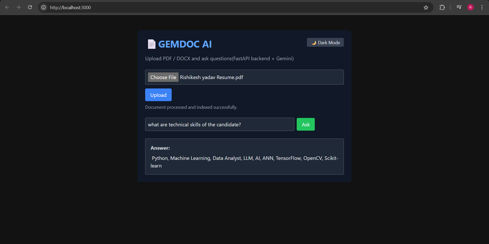

# 📄 GEMDOC AI – Document Question Answering with Google Gemini

GEMDOC AI is a smart **document assistant** that helps you extract insights from **PDF or DOCX files**.  
Whether it’s a **resume, research paper, report, or contract**, simply upload the file and ask questions in natural language.

---

## 🚀 Features
- 📂 Upload **PDF or DOCX** files
- ✂️ Automatic text **extraction + chunking**
- 🔎 Fast semantic search with **FAISS**
- 🤖 Powered by **Google Gemini API** for accurate answers
- 🌐 Backend with **FastAPI**
- ⚛️ Frontend with **React.js**
- 🐳 Supports **Docker** for containerized deployment

---

## 📸 Screenshot
Here’s a quick look at the app in action:



---

## 🛠️ Tech Stack
- **Backend** → FastAPI, FAISS, Sentence-Transformers  
- **Frontend** → React.js  
- **LLM** → Google Gemini 2.5 Flash  
- **Containerization** → Docker & Docker Compose  

---

## ⚡ How It Works
1. Upload your PDF/DOCX document.  
2. The system extracts text and stores embeddings in FAISS.  
3. When you ask a question, the most relevant chunks are retrieved.  
4. Gemini LLM generates a **context-aware response**.  

---

## 📂 Project Structure
```

Gemdoc-AI/
│── backend/        # FastAPI backend
│── frontend/       # React frontend
│── docker-compose.yml
│── .env.example
│── screenshot/     # App screenshots
│── README.md

````

---

## 🛠️ Deployment
- **Local Development**  
  ```bash
  docker compose up --build
````

* **Frontend** → Runs on `http://localhost:3000`
* **Backend** → Runs on `http://localhost:8000/docs`

---

## 📌 Notes

* Requires a valid **Gemini API Key** → [Get from Google AI Studio](https://aistudio.google.com/).
* Best results on English text.
* Large or image-heavy DOCX/PDF may extract less text.

---

👨‍💻 Author

  Rishikesh Yadav
🚀 Startup-focused developer | AI & Cloud Enthusiast
🔗 [GitHub Profile](https://github.com/yadav2rishikesh)


